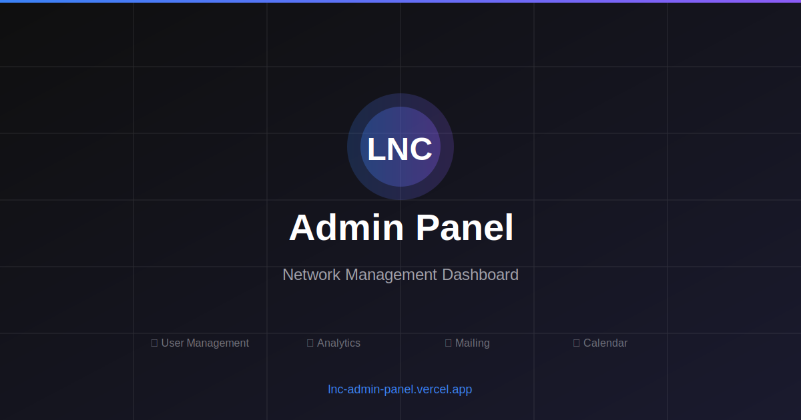
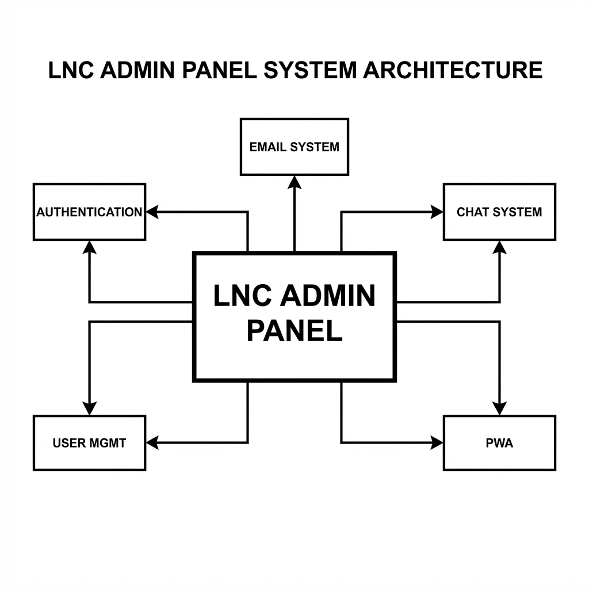

<div align="center">
  
  <br />
  <h1>LNC Admin Panel</h1>
  <p><strong>The Operational Hub for LNC Network</strong></p>
  
  

  <p>
    <a href="#-about-lnc-admin-panel">About</a> •
    <a href="#-key-features">Key Features</a> •
    <a href="#-tech-stack-for-developers">Build Info</a> •
    <a href="#-documentation-guides">Docs</a>
  </p>
</div>

---

## 👋 About LNC Admin Panel

Welcome to the **LNC Admin Panel**. This platform serves as the central command center for the entire LNC Network team. It is custom-built to streamline our daily operations, enhance team collaboration, and provide secure access to critical tools.

**Who is this for?**
- **Administrators**: To manage team access, approve new members, and oversee system settings.
- **Content Teams**: To upload media, track assets, and manage campaigns.
- **Developers**: To track issues, manage technical tickets, and maintain the platform.
- **Network Support**: To handle inquiries and monitor network activity.

## 🌟 Key Features

### 👥 Team Organization
- **Smart Access Control**: Securely login with role-based permissions tailored for your specific team (Dev, Social, PR, Design).
- **Team Directory**: Easily find and connect with other team members.
- **Registration Approval**: New members are vetted through a secure approval workflow.

### 💬 Unified Communication
- **Team Chat**: Instant messaging built directly into your workflow. Create groups or chat 1-on-1.
- **Ticket System**: A robust issue tracking system to report bugs or request features without leaving the dashboard.

### 🚀 Operational Tools
- **Files & Media**: Centralized storage for campaign assets and documents.
- **Forms**: Create and deploy custom forms to collect data from the community.
- **Database Management**: (Admin Only) Direct tools to view and manage network data.

---

<!-- Technical Section for Developers -->
<details>
<summary><strong>💻 Developer & Technical Information (Click to Expand)</strong></summary>

### 🛠️ Tech Stack
This project is built using modern web technologies:
- **Framework**: Next.js 16 (App Router)
- **Language**: TypeScript
- **Styling**: Tailwind CSS + shadcn/ui
- **Database**: Supabase (PostgreSQL)
- **Auth**: Custom JWT with Argon2 Hashing

### 📋 Prerequisites
- Node.js 18.x or higher
- Bun (recommended) or pnpm/npm
- A Supabase account and project

### 🚀 Quick Start
1. **Clone the repository**
   ```bash
   git clone https://github.com/LNC-Network/lnc-adminPanel.git
   ```

2. **Install dependencies**
   ```bash
   bun install
   ```

3. **Set up environment**
   Copy `.env.local.example` to `.env.local` and add your Supabase keys.

4. **Run Development Server**
   ```bash
   bun dev
   ```
   Visit [http://localhost:3000](http://localhost:3000)

</details>

---

## 🏗️ System Overview



---

## 📚 Documentation & Guides

We have comprehensive documentation to help you navigate and develop the system:

### For Administrators
- **[User Guide](docs/USER-GUIDE.md)** - User management, permissions, and registration approval

### For Developers & Technical Team
- **[Setup Guide](docs/SETUP-GUIDE.md)** - Installation, configuration, and environment setup
- **[System Architecture](docs/ARCHITECTURE.md)** - Technical architecture with visual diagrams
- **[Developer Guide](docs/DEVELOPER-GUIDE.md)** - Testing, troubleshooting, and feature documentation
- **[Documentation Index](docs/README.md)** - Complete documentation overview

### Quick Links
| Task | Documentation |
|------|---------------|
| First-time setup | [Setup Guide](docs/SETUP-GUIDE.md#initial-setup) |
| Approve new users | [User Guide](docs/USER-GUIDE.md#user-registration-workflow) |
| Manage roles | [User Guide](docs/USER-GUIDE.md#managing-roles-and-permissions) |
| Email configuration | [Setup Guide](docs/SETUP-GUIDE.md#email-system-setup) |
| View architecture | [Architecture](docs/ARCHITECTURE.md) |

## 🔒 Security & Privacy

Your data security is our priority.
- **Encrypted Passwords**: We use industry-standard Argon2 hashing.
- **Secure Sessions**: All access is protected via secure JWT tokens.
- **Granular Permissions**: 10-tier role system ensures users only access what they need.

---

<div align="center">
  <p>Built with ❤️ by the <strong>LNC Network Dev Team</strong></p>
  <p>© 2026 LNC Network</p>
</div>
