# System Architecture

> **Technical architecture documentation with visual diagrams for the LNC Admin Panel.**

## Table of Contents

- [Permission System Architecture](#permission-system-architecture)
- [Database Schema](#database-schema)
- [Email Notification System](#email-notification-system)
- [User Registration Flow](#user-registration-flow)
- [PWA Architecture](#pwa-architecture)
- [Chat Notification System](#chat-notification-system)

---

## Permission System Architecture

### Role Hierarchy


### Permission Check Flow

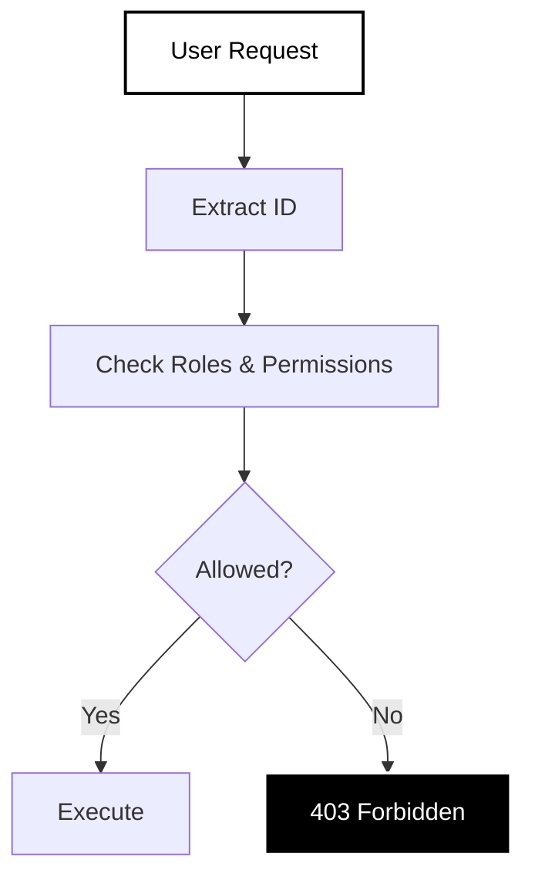

### Access Control Summary

| Role | User Mgmt | Content | Settings | Database |
|------|-----------|---------|----------|----------|
| **Super Admin** | Full | Full | Full | Full |
| **Adminstater** | Read | Read | Read | No |
| **Team Admin** | Team | Team | Team | No |
| **Team Member** | No | Create/Read | No | No |

### Implementation Layers

### Implementation Layers

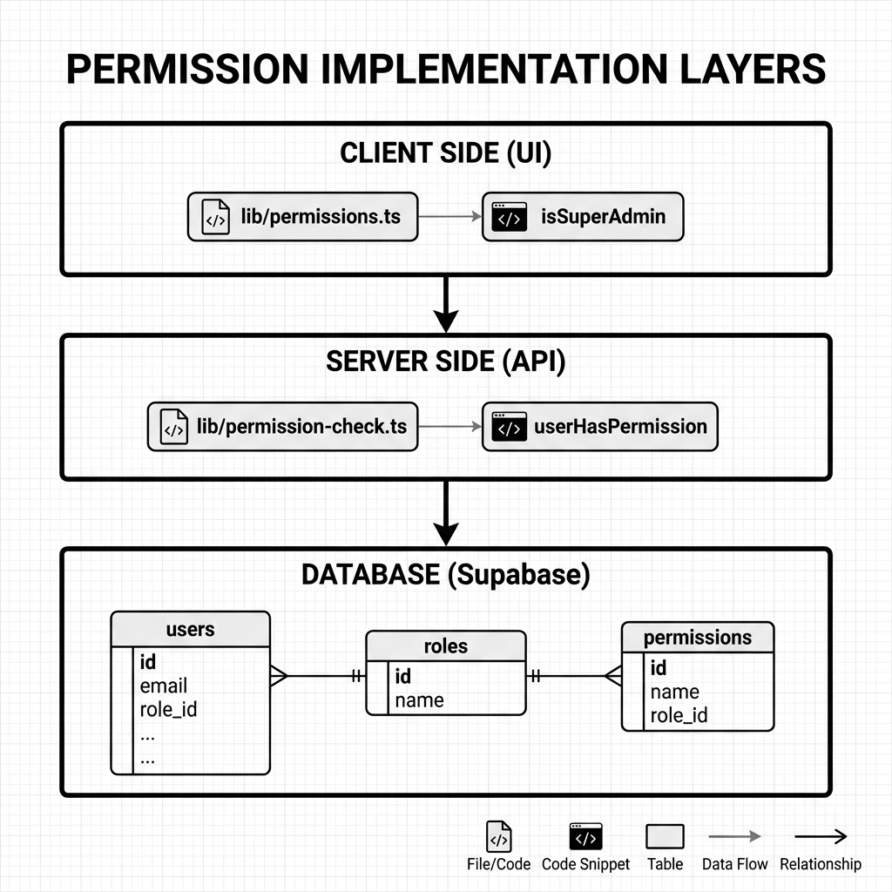

---

## Database Schema

### Entity Relationships

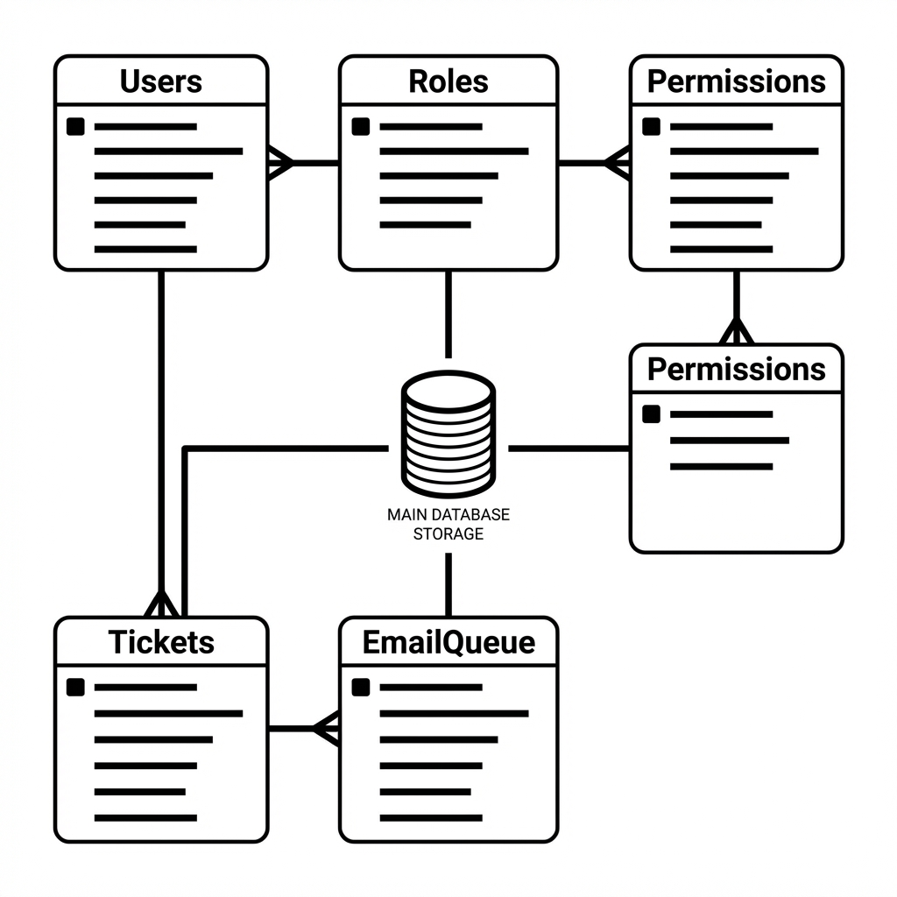

The database consists of five core entities:
- **Users**: Central identity with authentication details.
- **Roles & Permissions**: Manage access control (concise pivot tables).
- **EmailQueue**: Tracks notifications.
- **Tickets**: Manages support requests.


### Core Tables Structure

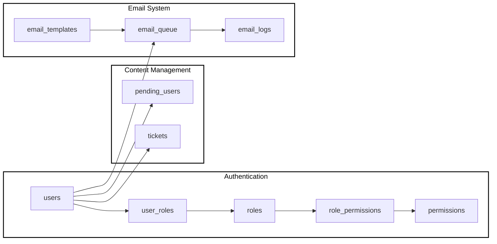

---

## Email Notification System

### Email Queue Processing Flow

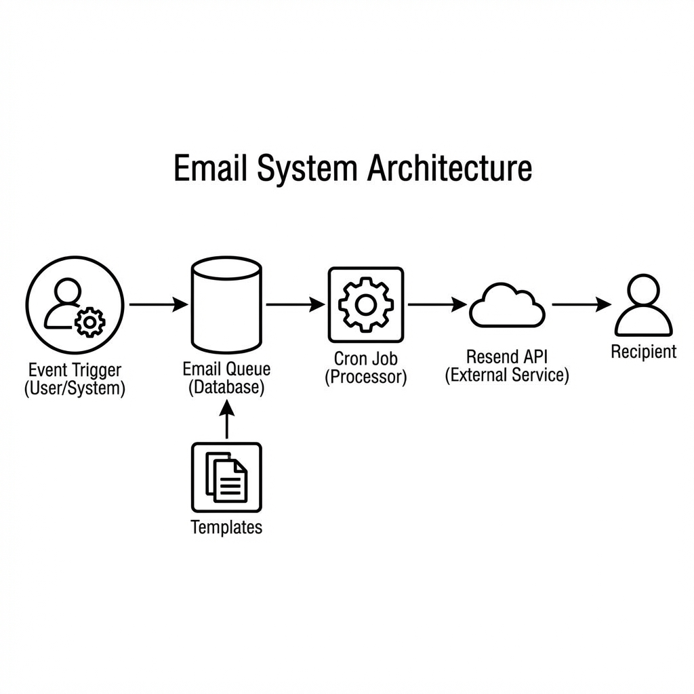

### Available Email Templates

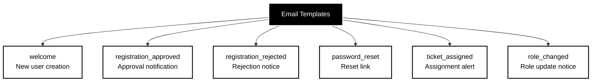

---

## User Registration Flow

### Complete Registration Workflow

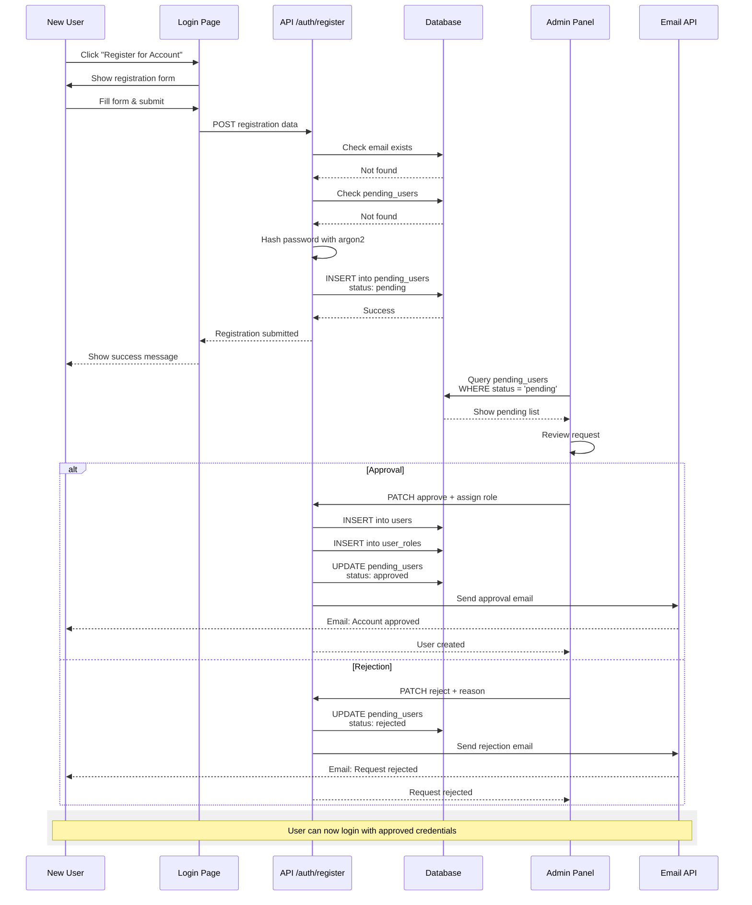

### Registration State Machine

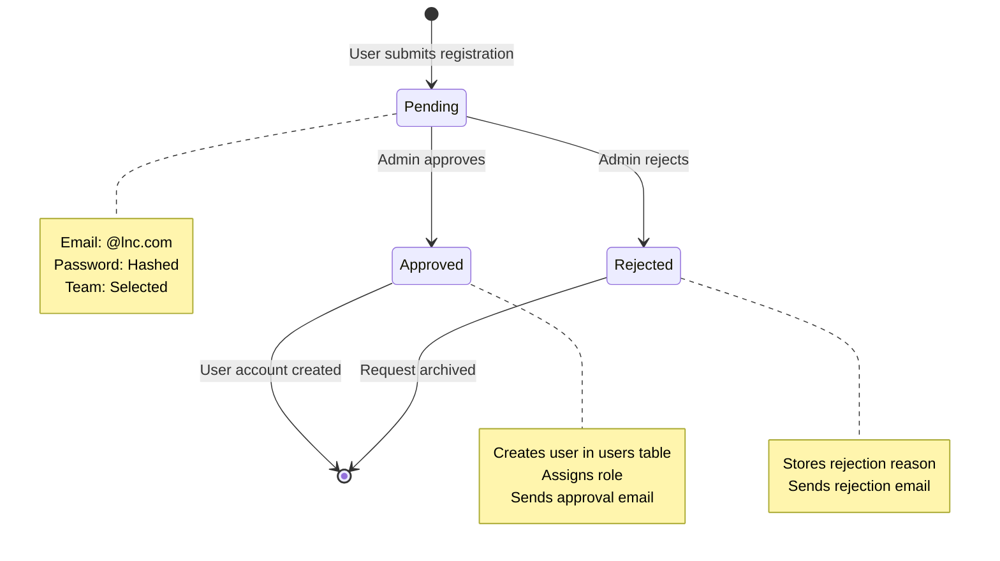

---

## PWA Architecture

### Service Worker Caching Strategy

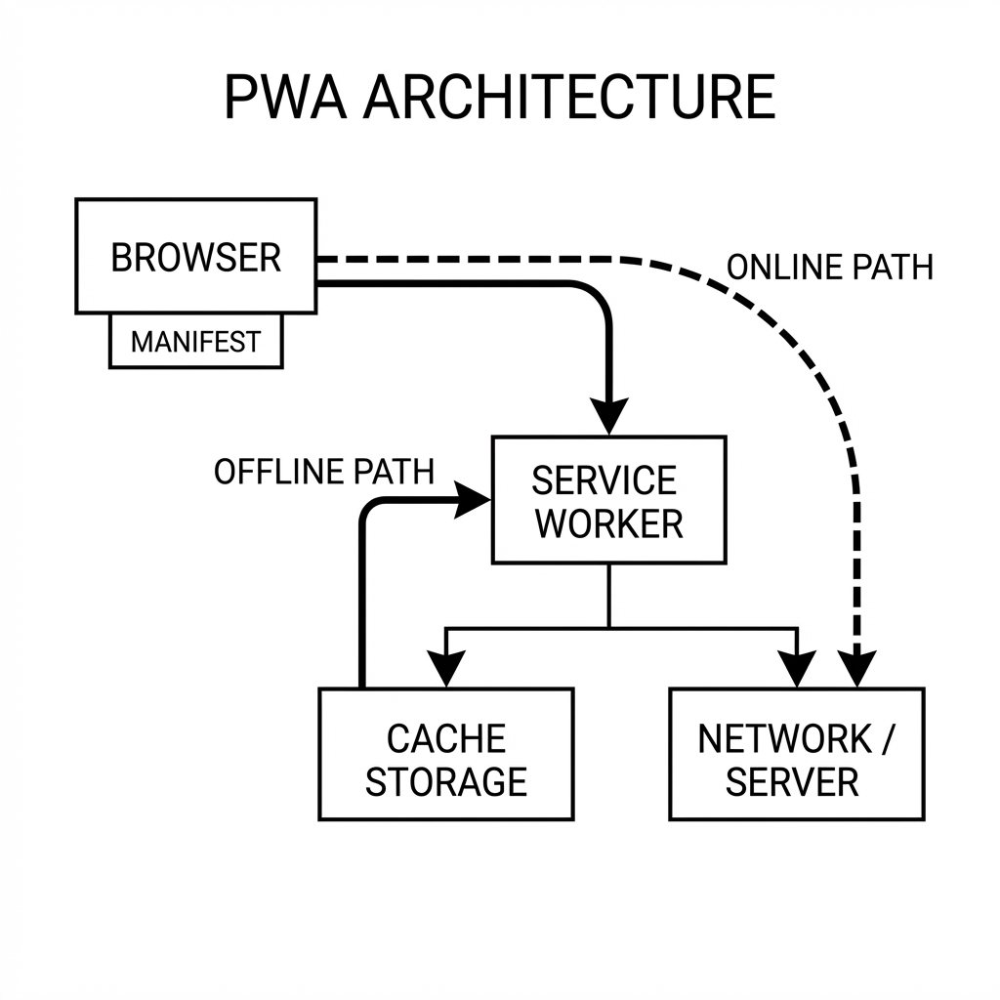

### PWA Component Structure

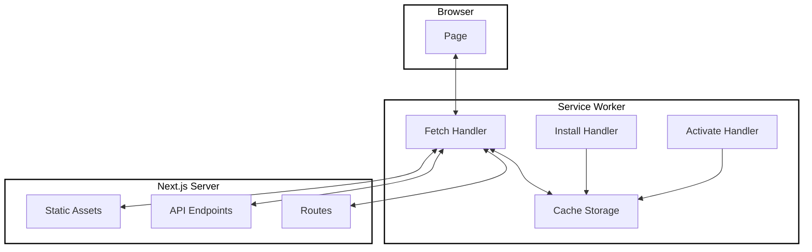

### Install Flow

```mermaid
sequenceDiagram
    participant U as User
    participant B as Browser
    participant SW as Service Worker
    participant M as Manifest
    
    U->>B: Visit site (HTTPS)
    B->>SW: Register service worker
    SW->>SW: Install event
    SW->>SW: Cache core assets
    B->>M: Parse manifest.json
    B->>B: Check installability
    B->>U: Show install prompt
    U->>B: Click "Install"
    B->>B: Add to home screen
    B->>U: Launch as standalone app
    
    rect rgb(240,240,240)
        Note over U,M: App now works offline<br/>and has app icon
    end rect
```

---

## Chat Notification System

### Unseen Message Tracking

## Chat Notification System

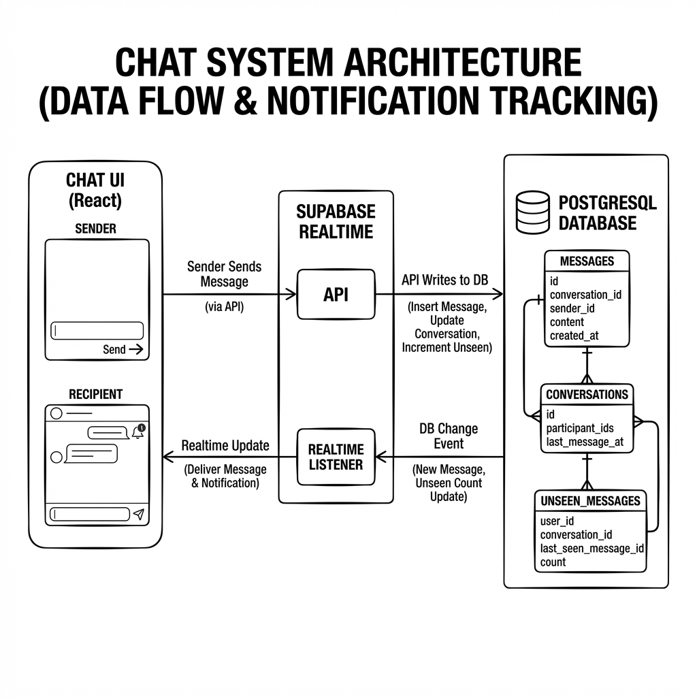

### Unseen Message Tracking

The system tracks every message sent to a conversation and increments the unseen count for recipients. When a user views the conversation, the count is cleared.

### Real-time Updates

Supabase Realtime listens for changes to the `messages` table and instantly updates the UI for active users.

---

## File Organization

### Project Structure

```
lnc-adminPanel/
├── app/
│   ├── api/
│   │   ├── auth/
│   │   │   ├── login/route.ts          ← JWT generation
│   │   │   └── register/route.ts       ← User registration
│   │   ├── users/
│   │   │   ├── create/route.ts         ← User creation (Super Admin)
│   │   │   ├── pending/route.ts        ← Approval/rejection
│   │   │   └── update-roles/route.ts   ← Role management
│   │   ├── email/
│   │   │   ├── send/route.ts           ← Send emails
│   │   │   ├── queue/route.ts          ← View queue
│   │   │   └── process/route.ts        ← Cron processor
│   │   └── chat/
│   │       ├── messages/route.ts       ← Message CRUD
│   │       └── mark-read/route.ts      ← Clear unseen
│   └── dashboard/
│       └── page.tsx                    ← Main dashboard
├── components/
│   ├── dashboard/                      ← Dashboard components
│   ├── ui/                             ← shadcn/ui components
│   └── pwa-register.tsx               ← PWA functionality
├── lib/
│   ├── permissions.ts                  ← Client-side helpers
│   ├── permission-check.ts             ← Server-side checks
│   ├── email-service.ts                ← Email functions
│   └── supabase.ts                     ← Database client
├── public/
│   ├── manifest.json                   ← PWA manifest
│   ├── service-worker.js               ← Offline caching
│   └── icons/                          ← PWA icons
└── docs/                               ← Documentation
    ├── README.md
    ├── ARCHITECTURE.md                 ← This file
    ├── SETUP-GUIDE.md
    ├── USER-GUIDE.md
    └── DEVELOPER-GUIDE.md
```

---

## Technology Dependencies

## Technology Dependencies

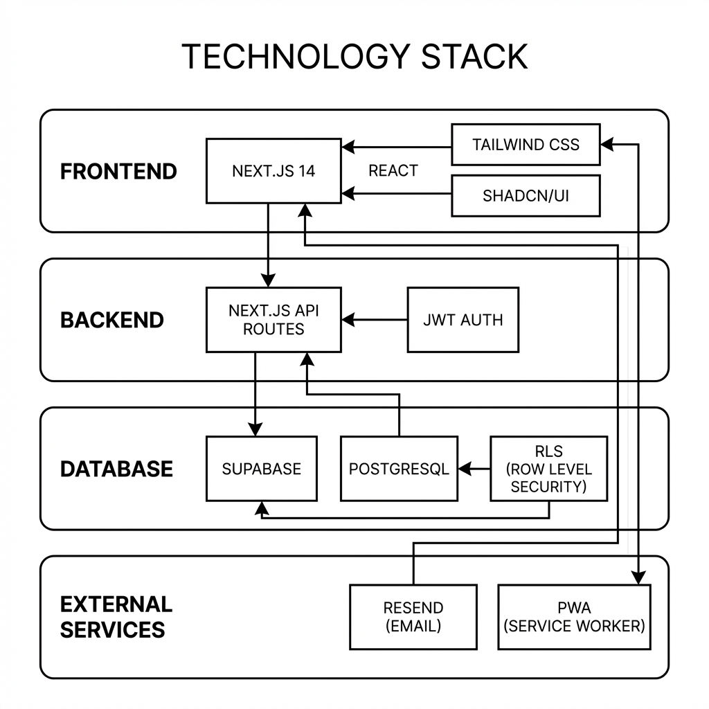

---

**Navigation**: [← Back to Index](README.md) | [Next: Setup Guide →](SETUP-GUIDE.md)

