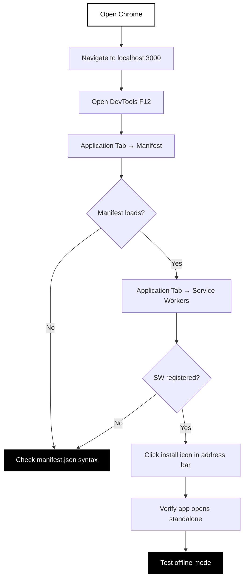
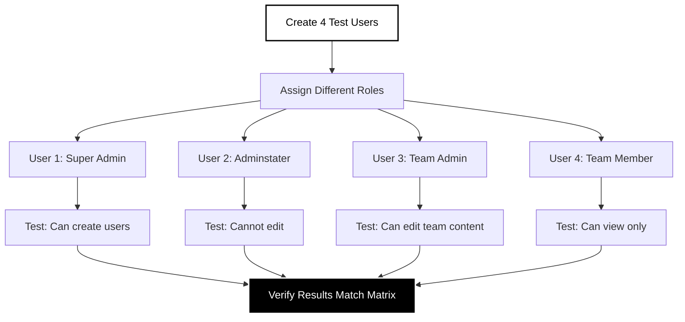
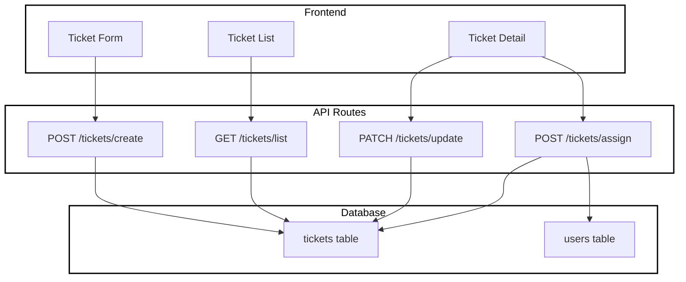
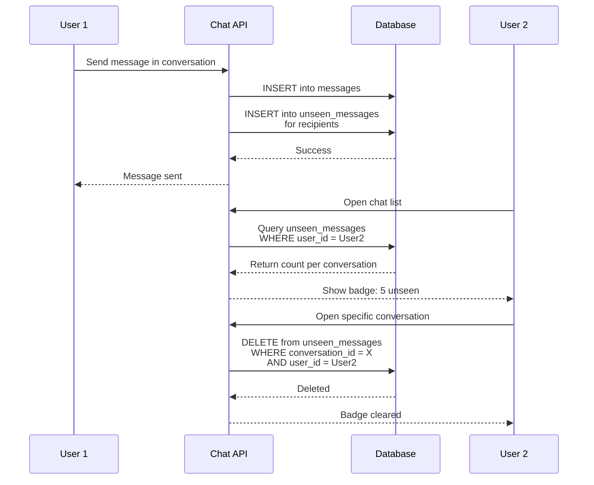

# Developer Guide

> **Testing, troubleshooting, and feature documentation for developers working on the LNC Admin Panel.**

## Table of Contents

- [Testing Procedures](#testing-procedures)
- [Feature Documentation](#feature-documentation)
- [API Reference](#api-reference)
- [Troubleshooting](#troubleshooting)
- [Development Best Practices](#development-best-practices)

---

## Testing Procedures

### PWA Testing

#### Desktop Installation Test



**Steps**:
1. Build and start: `npm run build && npm start`
2. Open Chrome DevTools (F12)
3. Navigate to **Application** tab
4. Check **Manifest** section:
   - Name: "LNC Admin Panel"
   - Icons: All 9 sizes present
   - Start URL: "/"
   - Display: "standalone"
5. Check **Service Workers**:
   - Status: "Activated and running"
   - Source: `/service-worker.js`
6. Click install icon in address bar
7. Verify app opens in standalone window

#### Mobile Installation Test

**Android (Chrome)**:
1. Deploy to public URL (HTTPS required)
2. Open on Android device
3. Chrome shows "Add to Home Screen" banner
4. Tap banner →Install
5. Icon appears on home screen
6. Open app → Runs without browser UI

**iOS (Safari)**:
1. Open site in Safari
2. Tap Share button
3. Select "Add to Home Screen"
4. Icon appears on home screen
5. Open → Runs as web app

#### Offline Test

```bash
# In DevTools
1. Application → Service Workers → "Offline" checkbox
2. Navigate between pages
3. Verify pages load from cache
4. Check offline banner appears
```

#### Lighthouse PWA Audit

```bash
npm run build
npm start
# Open DevTools → Lighthouse
# Categories: PWA only
# Device: Desktop/Mobile
# Click "Generate report"
# Target Score: 90+
```

**Common Issues**:
- Score < 90: Check HTTPS, manifest, icons
- "No matching service worker": Clear cache, re-register
- Icons missing: Regenerate with `node scripts/generate-svg-icons.js`

---

### Email System Testing

#### Manual Email Test

```bash
# 1. Create test user
POST http://localhost:3000/api/users/create
{
  "email": "test@lnc.com",
  "password": "test123",
  "role": "dev member"
}

# 2. Check email queue
SELECT * FROM email_queue 
WHERE to_email = 'test@lnc.com' 
ORDER BY created_at DESC;

# 3. Process queue
curl -X POST http://localhost:3000/api/email/process \
  -H "Authorization: Bearer YOUR_CRON_SECRET"

# 4. Verify sent
SELECT * FROM email_queue WHERE status = 'sent';
```

#### Email Queue Status

```sql
-- View queue statistics
SELECT 
  status,
  COUNT(*) as count,
  MIN(created_at) as oldest,
  MAX(created_at) as newest
FROM email_queue
GROUP BY status;

-- View failed emails with errors
SELECT 
  to_email,
  subject,
  error_message,
  retry_count,
  created_at
FROM email_queue
WHERE status = 'failed'
ORDER BY created_at DESC;
```

#### Test All Email Templates

```javascript
// Test script for all templates
const templates = [
  'welcome',
  'registration_approved',
  'registration_rejected',
  'role_changed',
  'ticket_assigned'
];

for (const template of templates) {
  await fetch('http://localhost:3000/api/email/send', {
    method: 'POST',
    headers: { 'Content-Type': 'application/json' },
    body: JSON.stringify({
      type: 'template',
      to: 'test@lnc.com',
      variables: {
        templateName: template,
        name: 'Test User',
        // ... add other required variables
      }
    })
  });
}
```

---

### Permission Testing

#### Test Permission Matrix



**Test Cases**:

| User Role | Test | Expected Result |
|-----------|------|-----------------|
| Super Admin | Create user via Settings | ✓ Success |
| Super Admin | Access Database tab | ✓ Visible |
| Super Admin | Delete user | ✓ Success |
| Adminstater | Create user via Settings | ✗ Form disabled |
| Adminstater | Edit user role | ✗ Buttons disabled |
| Adminstater | View users | ✓ Can view |
| Team Admin | Create content | ✓ Success |
| Team Admin | Delete content | ✓ Success |
| Team Admin | Access Database tab | ✗ Not visible |
| Team Member | Create content | ✓ Success |
| Team Member | Delete content | ✗ Button disabled |
| Team Member | Edit other's content | ✗ Button disabled |

**Automated Test Script**:

```sql
-- Create test users
INSERT INTO users (email, display_name, password_hash)
VALUES 
  ('test-super@lnc.com', 'Test Super', 'hash1'),
  ('test-admin@lnc.com', 'Test Admin', 'hash2'),
  ('test-tadmin@lnc.com', 'Test Team Admin', 'hash3'),
  ('test-member@lnc.com', 'Test Member', 'hash4');

-- Assign roles
INSERT INTO user_roles (user_id, role_id)
SELECT u.id, r.id
FROM users u
CROSS JOIN roles r
WHERE (u.email = 'test-super@lnc.com' AND r.name = 'super admin')
   OR (u.email = 'test-admin@lnc.com' AND r.name = 'adminstater')
   OR (u.email = 'test-tadmin@lnc.com' AND r.name = 'dev team admin')
   OR (u.email = 'test-member@lnc.com' AND r.name = 'dev member');

-- Verify assignments
SELECT u.email, string_agg(r.name, ', ') as roles
FROM users u
JOIN user_roles ur ON u.id = ur.user_id
JOIN roles r ON ur.role_id = r.id
WHERE u.email LIKE 'test-%@lnc.com'
GROUP BY u.email;
```

---

## Feature Documentation

### Ticket System

#### Architecture



#### Ticket Fields

| Field | Type | Required | Description |
|-------|------|----------|-------------|
| number | INT | Auto | Sequential ticket number |
| title | TEXT | Yes | Short description |
| description | TEXT | Yes | Full details |
| status | TEXT | Yes | open/in-progress/resolved/closed |
| priority | TEXT | Yes | low/medium/high/urgent |
| created_by | UUID | Auto | User who created ticket |
| assigned_to | UUID | No | Assigned team member |
| created_at | TIMESTAMP | Auto | Creation timestamp |
| updated_at | TIMESTAMP | Auto | Last update timestamp |

#### Usage Example

```typescript
// Create ticket
const response = await fetch('/api/tickets/create', {
  method: 'POST',
  headers: { 'Content-Type': 'application/json' },
  body: JSON.stringify({
    title: 'Fix login bug',
    description: 'Users cannot login with valid credentials',
    priority: 'high',
    status: 'open'
  })
});

// Assign ticket
await fetch('/api/tickets/assign', {
  method: 'POST',
  body: JSON.stringify({
    ticket_id: 'TICKET_UUID',
    assigned_to: 'USER_UUID'
  })
});
```

---

### Chat Notification System

#### Unseen Message Tracking



#### Database Schema

```sql
-- Messages table
CREATE TABLE messages (
  id UUID PRIMARY KEY DEFAULT gen_random_uuid(),
  conversation_id UUID NOT NULL,
  sender_id UUID REFERENCES users(id),
  content TEXT NOT NULL,
  created_at TIMESTAMPTZ DEFAULT NOW()
);

-- Unseen messages tracking
CREATE TABLE unseen_messages (
  user_id UUID REFERENCES users(id),
  conversation_id UUID NOT NULL,
  message_id UUID REFERENCES messages(id),
  PRIMARY KEY (user_id, message_id)
);
```

#### API Endpoints

**GET /api/chat/messages**
```typescript
// Query params: conversation_id, limit, offset
Response: {
  messages: Message[],
  total: number
}
```

**POST /api/chat/send**
```typescript
Request: {
  conversation_id: UUID,
  content: string
}
Response: {
  message_id: UUID,
  created_at: timestamp
}
```

**PATCH /api/chat/mark-read**
```typescript
Request: {
  conversation_id: UUID
}
Response: {
  cleared: number  // Count of unseen cleared
}
```

---

### Encryption Implementation

#### Encrypted Fields

The following fields are encrypted at rest:

- User email addresses (optional)
- User personal information
- Sensitive chat messages
- API keys in database

#### Encryption Flow

```mermaid
flowchart LR
    A[Plain Text] --> B[AES-256-GCM Encryption]
    B --> C[Store IV + Encrypted + Tag]
    C --> D[Database]
    
    D --> E[Retrieve Encrypted Data]
    E --> F[AES-256-GCM Decryption]
    F --> G[Plain Text]
    
    style A fill:#fff,stroke:#000,stroke-width:2px,color:#000
    style B fill:#fff,stroke:#000,stroke-width:2px,color:#000
    style D fill:#fff,stroke:#000,stroke-width:2px,color:#000
    style F fill:#fff,stroke:#000,stroke-width:2px,color:#000
    style G fill:#fff,stroke:#000,stroke-width:2px,color:#000
```



#### Encryption Functions

```typescript
// lib/encryption.ts

import crypto from 'crypto';

const ALGORITHM = 'aes-256-gcm';
const KEY = Buffer.from(process.env.ENCRYPTION_KEY!, 'hex');

export function encrypt(text: string): string {
  const iv = crypto.randomBytes(16);
  const cipher = crypto.createCipheriv(ALGORITHM, KEY, iv);
  
  let encrypted = cipher.update(text, 'utf8', 'hex');
  encrypted += cipher.final('hex');
  
  const authTag = cipher.getAuthTag();
  
  // Format: iv:encrypted:authTag
  return `${iv.toString('hex')}:${encrypted}:${authTag.toString('hex')}`;
}

export function decrypt(encryptedData: string): string {
  const [ivHex, encrypted, authTagHex] = encryptedData.split(':');
  
  const iv = Buffer.from(ivHex, 'hex');
  const authTag = Buffer.from(authTagHex, 'hex');
  
  const decipher = crypto.createDecipheriv(ALGORITHM, KEY, iv);
  decipher.setAuthTag(authTag);
  
  let decrypted = decipher.update(encrypted, 'hex', 'utf8');
  decrypted += decipher.final('utf8');
  
  return decrypted;
}
```

#### Generate Encryption Key

```bash
# Generate 256-bit (32 byte) key
node -e "console.log(require('crypto').randomBytes(32).toString('hex'))"

# Add to .env.local
ENCRYPTION_KEY=your_64_character_hex_string
```

---

## API Reference

### Authentication Endpoints

#### POST /api/auth/login

**Request**:
```json
{
  "email": "user@lnc.com",
  "password": "userpassword"
}
```

**Response (Success)**:
```json
{
  "success": true,
  "token": "jwt_token_here",
  "user": {
    "id": "uuid",
    "email": "user@lnc.com",
    "roles": ["dev member"],
    "permissions": ["content.create", "content.read", ...]
  }
}
```

**Response (Error)**:
```json
{
  "error": "Invalid credentials"
}
```

#### POST /api/auth/register

**Request**:
```json
{
  "display_name": "John Doe",
  "email": "john@lnc.com",
  "password": "securepass",
  "team": "Development"
}
```

**Response**:
```json
{
  "success": true,
  "message": "Registration submitted. Please wait for admin approval."
}
```

---

### User Management Endpoints

#### POST /api/users/create

**Permission Required**: `user.create` (Super Admin only)

**Request**:
```json
{
  "email": "newuser@lnc.com",
  "password": "password123",
  "role": "dev member"
}
```

**Response**:
```json
{
  "success": true,
  "user_id": "uuid",
  "message": "User created successfully"
}
```

#### GET /api/users/list

**Permission Required**: `user.read`

**Response**:
```json
{
  "users": [
    {
      "id": "uuid",
      "email": "user@lnc.com",
      "display_name": "John Doe",
      "roles": ["dev member", "dev team admin"],
      "created_at": "2024-01-15T10:30:00Z"
    }
  ]
}
```

#### PATCH /api/users/update-roles

**Permission Required**: `user.update`

**Request**:
```json
{
  "user_id": "uuid",
  "role_ids": ["role-uuid-1", "role-uuid-2"]
}
```

#### DELETE /api/users/delete

**Permission Required**: `user.delete` (Super Admin only)

**Request**:
```json
{
  "user_id": "uuid"
}
```

---

### Email Endpoints

#### POST /api/email/send

**Request (Template)**:
```json
{
  "type": "template",
  "to": "user@lnc.com",
  "variables": {
    "templateName": "welcome",
    "name": "John Doe",
    "email": "user@lnc.com",
    "role": "dev member",
    "loginUrl": "https://admin.lnc.com/login"
  }
}
```

**Request (Custom)**:
```json
{
  "type": "custom",
  "to": "user@lnc.com",
  "subject": "Important Update",
  "html": "<h1>Hello</h1><p>Message here</p>",
  "text": "Hello\n\nMessage here"
}
```

#### GET /api/email/queue

**Query Params**:
- `status`: pending|sent|failed|retry
- `limit`: number (default 50)
- `offset`: number (default 0)

**Response**:
```json
{
  "emails": [
    {
      "id": "uuid",
      "to_email": "user@lnc.com",
      "subject": "Welcome to LNC",
      "status": "sent",
      "created_at": "2024-01-15T10:30:00Z",
      "sent_at": "2024-01-15T10:35:00Z"
    }
  ],
  "total": 150
}
```

#### POST /api/email/process

**Headers**: `Authorization: Bearer CRON_SECRET`

**Response**:
```json
{
  "message": "Email processing completed",
  "processed": 10,
  "successful": 9,
  "failed": 1
}
```

---

## Troubleshooting

### Build Errors

#### Error: "Module not found"

```bash
# Clear node_modules and reinstall
rm -rf node_modules
rm package-lock.json
npm install
```

#### Error: "Type error in component"

```bash
# Check TypeScript
npx tsc --noEmit

# Fix type errors, then rebuild
npm run build
```

### Runtime Errors

#### Error: "Failed to fetch" in browser

**Cause**: API route returning 500 error

**Debug**:
1. Check terminal for server errors
2. Add console.logs to API route
3. Check database connection
4. Verify environment variables

#### Error: "Unauthorized" despite being logged in

**Cause**: JWT token invalid or expired

**Fix**:
```javascript
// Clear local storage and re-login
localStorage.clear();
// Navigate to /login
```

### Database Errors

#### Error: "relation does not exist"

**Cause**: Migration not run

**Fix**:
```sql
-- List all tables
SELECT table_name FROM information_schema.tables 
WHERE table_schema = 'public';

-- Run missing migrations from SQL/ folder
```

#### Error: "duplicate key value violates unique constraint"

**Cause**: Trying to insert duplicate email/id

**Fix**:
```sql
-- Check existing records
SELECT * FROM users WHERE email = 'user@lnc.com';

-- Delete if it's a test record
DELETE FROM users WHERE email = 'test@lnc.com';
```

---

## Development Best Practices

### Code Organization

```
app/api/
├── [feature]/
│   ├── route.ts          ← Main CRUD operations
│   ├── [action]/
│   │   └── route.ts      ← Specific actions
```

### Permission Checks

**Always check permissions in API routes**:

```typescript
// ❌ Bad - No permission check
export async function POST(request: Request) {
  const { userId } = await request.json();
  await deleteUser(userId);
}

// ✅ Good - Permission checked
export async function POST(request: Request) {
  const currentUser = await getUserFromToken(request);
  
  const hasPermission = await userHasPermission(
    currentUser.id, 
    PERMISSIONS.USER_DELETE
  );
  
  if (!hasPermission) {
    return NextResponse.json({ error: 'Forbidden' }, { status: 403 });
  }
  
  const { userId } = await request.json();
  await deleteUser(userId);
}
```

### Error Handling

```typescript
// ✅ Proper error handling
export async function POST(request: Request) {
  try {
    const data = await request.json();
    
    // Validate input
    if (!data.email || !data.password) {
      return NextResponse.json(
        { error: 'Missing required fields' },
        { status: 400 }
      );
    }
    
    // Process request
    const result = await createUser(data);
    
    return NextResponse.json({ success: true, result });
    
  } catch (error) {
    console.error('Error creating user:', error);
    return NextResponse.json(
      { error: 'Internal server error' },
      { status: 500 }
    );
  }
}
```

### Database Queries

```typescript
// ✅ Use parameterized queries
const { data } = await supabase
  .from('users')
  .select('*')
  .eq('email', email)  // Prevents SQL injection
  .single();

// ❌ Avoid string interpolation
const query = `SELECT * FROM users WHERE email = '${email}'`;  // Vulnerable!
```

---

**Navigation**: [← Back to Index](README.md) | [← Previous: User Guide](USER-GUIDE.md)
