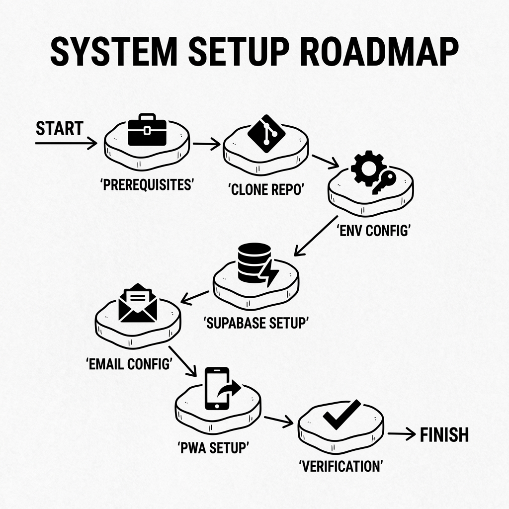
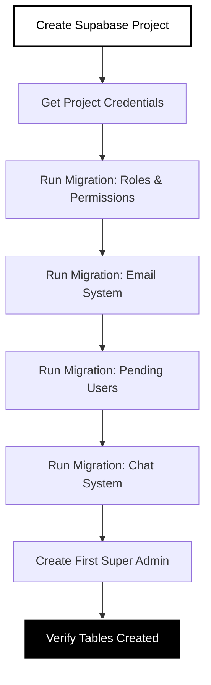
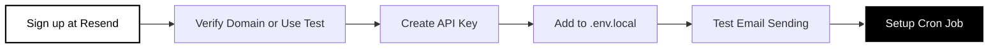
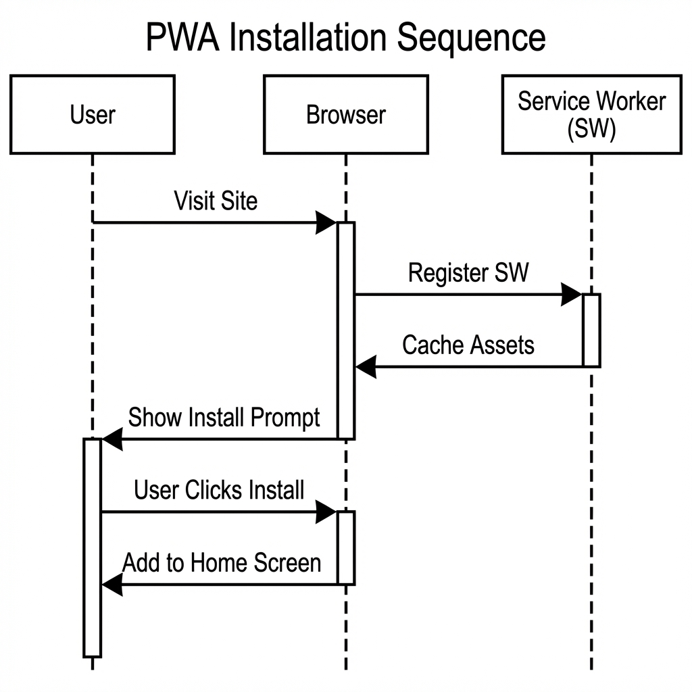
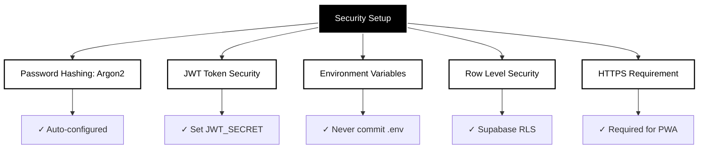

# Setup Guide

> **Complete installation and configuration instructions for the LNC Admin Panel.**

## Table of Contents

- [Prerequisites](#prerequisites)
- [Initial Setup](#initial-setup)
- [Database Configuration](#database-configuration)
- [Email System Setup](#email-system-setup)
- [PWA Configuration](#pwa-configuration)
- [Security Setup](#security-setup)
- [Verification](#verification)
- [Troubleshooting](#troubleshooting)

---

## Prerequisites

### Required Software

```
✓ Node.js 18+ or Bun
✓ Git
✓ Code editor (VS Code recommended)
✓ Supabase account
✓ Resend account (for email notifications)
```

### Setup Flowchart

### Setup Flowchart



---

## Initial Setup

### 1. Clone Repository

```bash
git clone <repository-url>
cd lnc-adminPanel
```

### 2. Install Dependencies

**Using npm:**
```bash
npm install
```

**Using bun:**
```bash
bun install
```

### 3. Environment Configuration

Create `.env.local` file in the project root:

```env
# Supabase Configuration
NEXT_PUBLIC_SUPABASE_URL=https://YOUR_PROJECT.supabase.co
SUPABASE_SERVICE_ROLE_KEY=your_service_role_key_here

# JWT Configuration (generate with: openssl rand -hex 32)
JWT_SECRET=your_random_64_character_hex_string_here

# Email Configuration (Resend)
RESEND_API_KEY=re_xxxxxxxxxxxxx
EMAIL_FROM=noreply@lnc.com
EMAIL_FROM_NAME=LNC Admin Panel

# Cron Job Security (generate with: openssl rand -hex 32)
CRON_SECRET=your_random_secret_for_cron_jobs

# Site URL
NEXT_PUBLIC_SITE_URL=http://localhost:3000

# PWA Configuration (optional)
NEXT_PUBLIC_APP_NAME=LNC Admin Panel
NEXT_PUBLIC_APP_SHORT_NAME=LNC Admin
```

### Generating Secrets

```bash
# Generate JWT_SECRET
openssl rand -hex 32

# Generate CRON_SECRET
openssl rand -hex 32
```

---

## Database Configuration

### Setup Process



### Step 1: Create Supabase Project

1. Go to [supabase.com](https://supabase.com)
2. Click "New Project"
3. Name: `lnc-admin-panel`
4. Database Password: (save securely)
5. Region: Choose closest to your users

### Step 2: Get Credentials

1. Go to **Settings** → **API**
2. Copy **Project URL** → `NEXT_PUBLIC_SUPABASE_URL`
3. Copy **service_role** key → `SUPABASE_SERVICE_ROLE_KEY`

### Step 3: Run Database Migrations

Navigate to **SQL Editor** in Supabase Dashboard and run these scripts in order:

#### Migration 1: Roles and Permissions

File: `SQL/setup-new-roles.sql`

```sql
-- Creates 10 roles
-- - 1 Super Admin
-- - 1 Adminstater
-- - 4 Team Admins
-- - 4 Team Members

-- Run this entire file in Supabase SQL Editor
```

#### Migration 2: Role Permissions

File: `SQL/setup-role-permissions.sql`

```sql
-- Creates 12 permissions
-- Assigns permissions to roles

-- Run this entire file in Supabase SQL Editor
```

#### Migration 3: Email System

File: `SQL/setup-email-system.sql`

```sql
-- Creates:
-- - email_templates table
-- - email_queue table
-- - email_logs table
-- - Default email templates

-- Run this entire file in Supabase SQL Editor
```

#### Migration 4: Pending Users

File: `SQL/setup-pending-users-table.sql`

```sql
-- Creates pending_users table for registration system

-- Run this entire file in Supabase SQL Editor
```

#### Migration 5: Verify Tables

```sql
-- Check all tables were created
SELECT table_name 
FROM information_schema.tables 
WHERE table_schema = 'public'
ORDER BY table_name;

-- Should see:
-- - users
-- - roles
-- - permissions
-- - user_roles
-- - role_permissions
-- - pending_users
-- - email_templates
-- - email_queue
-- - email_logs
-- - messages (if chat is set up)
-- - unseen_messages (if chat is set up)
```

### Step 4: Create First Super Admin

```sql
-- Find your user ID (login first via the app)
SELECT id, email FROM users WHERE email = 'your-email@lnc.com';

-- Assign super admin role (replace YOUR_USER_ID)
INSERT INTO user_roles (user_id, role_id)
SELECT 'YOUR_USER_ID', id FROM roles WHERE name = 'super admin';

-- Verify assignment
SELECT u.email, r.name as role
FROM users u
JOIN user_roles ur ON u.id = ur.user_id
JOIN roles r ON ur.role_id = r.id
WHERE u.email = 'your-email@lnc.com';
```

---

## Email System Setup

### Resend Configuration



### Step 1: Create Resend Account

1. Visit [resend.com](https://resend.com)
2. Sign up for free account
3. Verify your email

### Step 2: Domain Verification (Production)

**For production:**
1. Go to **Domains** → **Add Domain**
2. Enter `lnc.com`
3. Add DNS records to your domain:
   - TXT record for verification
   - MX, DKIM, SPF records
4. Wait for verification (can take 24-48 hours)

**For development:**
- Use Resend's test domain `onboarding@resend.dev`
- Emails only sent to your verified email address

### Step 3: Create API Key

1. Go to **API Keys** → **Create API Key**
2. Name: `LNC Admin Panel`
3. Permission: `Sending access`
4. Copy key → Add to `.env.local` as `RESEND_API_KEY`

### Step 4: Test Email System

Start the development server:
```bash
npm run dev
```

Create a test user via Settings page (as Super Admin). The system should automatically send a welcome email.

Check email queue:
```sql
SELECT * FROM email_queue ORDER BY created_at DESC LIMIT 10;
```

### Step 5: Setup Cron Job for Email Processing

**Option A: Vercel Cron** (Recommended for production)

Create `vercel.json`:
```json
{
  "crons": [
    {
      "path": "/api/email/process",
      "schedule": "*/5 * * * *"
    }
  ]
}
```

**Option B: External Cron Service** (e.g., cron-job.org)

- URL: `https://your-domain.com/api/email/process`
- Method: `POST`
- Headers: `Authorization: Bearer YOUR_CRON_SECRET`
- Schedule: Every 5 minutes

**Option C: Manual Processing** (Development)

```bash
curl -X POST http://localhost:3000/api/email/process \
  -H "Authorization: Bearer YOUR_CRON_SECRET"
```

---

## PWA Configuration

### PWA Setup Flowchart



### Step 1: Generate PWA Icons

Icons are already generated in `public/icons/`. To customize:

```bash
# Install dependencies
npm install sharp  # (optional, for PNG icons)

# Generate SVG icons (default)
node scripts/generate-svg-icons.js

# Or generate PNG icons
node scripts/generate-icons.js
```

Edit `scripts/generate-svg-icons.js` to customize:
- Background color
- Text/logo
- Gradient

### Step 2: Verify Manifest

Check `public/manifest.json`:

```json
{
  "name": "LNC Admin Panel",
  "short_name": "LNC Admin",
  "description": "Administrative panel for LNC Network",
  "start_url": "/",
  "display": "standalone",
  "background_color": "#000000",
  "theme_color": "#000000",
  "icons": [...],
  "shortcuts": [...]
}
```

### Step 3: Verify Service Worker

Check `public/service-worker.js` exists with:
- Cache name: `lnc-admin-v1`
- Cached URLs: `/`, `/dashboard`, `/login`
- Cache-first strategy

### Step 4: Test PWA

**Desktop (Chrome):**
1. Open DevTools (F12)
2. Go to **Application** → **Manifest**
3. Verify manifest loads
4. Go to **Service Workers**
5. Verify registration
6. Click install icon in address bar

**Lighthouse Audit:**
```bash
# Run Lighthouse PWA audit
npm run build
npm start
# Open http://localhost:3000
# DevTools → Lighthouse → PWA → Generate Report
# Target score: 90+
```

---

## Security Setup

### Security Checklist



### Password Hashing

Already configured to use **Argon2** (industry standard):
- Used in user registration
- Used in user creation
- Automatically salted and hashed

### JWT Security

Ensure strong `JWT_SECRET`:
```bash
# Generate 64-character hex string
openssl rand -hex 32
```

JWT tokens include:
- User ID
- Email
- Roles
- Permissions
- Expiration (24 hour default)

### Environment Security

**Never commit `.env.local`:**
```bash
# Add to .gitignore (already included)
.env.local
.env.*.local
```

**Production environment variables:**
- Set in Vercel/hosting platform dashboard
- Never hardcode secrets in code

### Row Level Security (RLS)

Enable RLS on sensitive tables:

```sql
-- Enable RLS on profiles
ALTER TABLE profiles ENABLE ROW LEVEL SECURITY;

-- Service role can access all
CREATE POLICY "Service role access" ON profiles
  FOR ALL USING (true);

-- Users can read their own profile
CREATE POLICY "Users read own" ON profiles
  FOR SELECT USING (auth.uid() = id);
```

### HTTPS in Production

**Required for:**
- PWA functionality
- Secure cookies
- Service worker registration

**Vercel/Netlify**: HTTPS automatic  
**Custom hosting**: Configure SSL certificate

---

## Verification

### Complete Verification Checklist

Run through this checklist to verify everything works:

#### Database Verification

```sql
-- Check all tables exist
SELECT COUNT(*) as table_count
FROM information_schema.tables
WHERE table_schema = 'public';
-- Should be 10+ tables

-- Check roles created
SELECT COUNT(*) FROM roles;
-- Should be 10 roles

-- Check permissions created
SELECT COUNT(*) FROM permissions;
-- Should be 12 permissions

-- Check your super admin assignment
SELECT u.email, string_agg(r.name, ', ') as roles
FROM users u
JOIN user_roles ur ON u.id = ur.user_id
JOIN roles r ON ur.role_id = r.id
WHERE u.email = 'your-email@lnc.com'
GROUP BY u.email;
-- Should show 'super admin'
```

#### Application Verification

- [ ] `npm run dev` starts without errors
- [ ] Navigate to http://localhost:3000
- [ ] Login page loads
- [ ] Can login with credentials
- [ ] Dashboard displays after login
- [ ] All tabs accessible (Overview, Chat, Content, etc.)
- [ ] Settings page shows user management
- [ ] Can view Database tab (Super Admin only)

#### Email Verification

- [ ] Create test user via Settings
- [ ] Check `email_queue` table for queued email
- [ ] Run email processor: `POST /api/email/process`
- [ ] Check email queue status changes to `sent`
- [ ] Verify email received (check spam folder)

#### PWA Verification

- [ ] DevTools → Application → Manifest shows configuration
- [ ] Service Worker status: "Activated and running"
- [ ] Browser shows install prompt
- [ ] Can install as desktop app
- [ ] App opens in standalone window
- [ ] Offline mode works (DevTools → Network → Offline)

#### Permission Verification

Create test users with different roles and verify:

- [ ] **Super Admin**: Can create users, access Database tab
- [ ] **Adminstater**: Can view but not edit (buttons disabled)
- [ ] **Team Admin**: Can edit team content, cannot access Database
- [ ] **Team Member**: Can view and edit own content only

---

## Troubleshooting

### Common Issues

#### Cannot Connect to Database

**Error**: `Failed to fetch` or `Could not connect to Supabase`

**Solution**:
1. Verify `NEXT_PUBLIC_SUPABASE_URL` is correct
2. Check `SUPABASE_SERVICE_ROLE_KEY` is the **service_role** key (not anon key)
3. Ensure Supabase project is not paused (free tier pauses after inactivity)

```bash
# Test database connection
curl https://YOUR_PROJECT.supabase.co/rest/v1/users \
  -H "apikey: YOUR_SERVICE_ROLE_KEY"
```

#### JWT Secret Error

**Error**: `JWT_SECRET not found` or `Invalid token`

**Solution**:
```bash
# Generate new secret
openssl rand -hex 32

# Add to .env.local
JWT_SECRET=generated_secret_here

# Restart dev server
npm run dev
```

#### Email Not Sending

**Error**: Emails stuck in `pending` status

**Solution**:
1. Verify `RESEND_API_KEY` is correct
2. Check domain is verified (or use test domain)
3. View error in `email_queue.error_message`:
   ```sql
   SELECT error_message, COUNT(*) 
   FROM email_queue 
   WHERE status = 'failed' 
   GROUP BY error_message;
   ```
4. Manually process queue:
   ```bash
   curl -X POST http://localhost:3000/api/email/process \
     -H "Authorization: Bearer YOUR_CRON_SECRET"
   ```

#### PWA Not Installing

**Error**: No install prompt appears

**Solution**:
1. Ensure using HTTPS (or localhost)
2. Check manifest.json loads (DevTools → Network)
3. Verify service worker registered (DevTools → Application → Service Workers)
4. Run Lighthouse audit for specific errors
5. Clear browser cache and reload

#### Permission Denied Errors

**Error**: `403 Forbidden` when accessing features

**Solution**:
1. Check user has roles assigned:
   ```sql
   SELECT u.email, r.name 
   FROM users u
   JOIN user_roles ur ON u.id = ur.user_id
   JOIN roles r ON ur.role_id = r.id
   WHERE u.email = 'user@lnc.com';
   ```
2. Verify role has required permissions:
   ```sql
   SELECT r.name, p.code
   FROM roles r
   JOIN role_permissions rp ON r.id = rp.role_id
   JOIN permissions p ON rp.permission_id = p.id
   WHERE r.name = 'role-name';
   ```
3. Clear browser cookies and re-login

#### Build Errors

**Error**: `npm run build` fails

**Solution**:
1. Clear Next.js cache:
   ```bash
   rm -rf .next
   npm run build
   ```
2. Check all environment variables are set
3. Verify no TypeScript errors:
   ```bash
   npm run type-check  # (if script exists)
   ```

---

## Next Steps

After completing setup:

1. **Configure Team Structure** - [User Guide](USER-GUIDE.md)
2. **Understand Permissions** - [Architecture](ARCHITECTURE.md#permission-system-architecture)
3. **Test Features** - [Developer Guide](DEVELOPER-GUIDE.md)
4. **Deploy to Production** - See hosting provider documentation

---

**Navigation**: [← Back to Index](README.md) | [Next: User Guide →](USER-GUIDE.md)

