# User Guide

> **Complete guide for administrators managing users, roles, and permissions in the LNC Admin Panel.**

## Table of Contents

- [Role Overview](#role-overview)
- [User Registration Workflow](#user-registration-workflow)
- [Managing Users](#managing-users)
- [Managing Roles and Permissions](#managing-roles-and-permissions)
- [Email Notifications](#email-notifications)
- [Common Administrative Tasks](#common-administrative-tasks)
- [Troubleshooting](#troubleshooting)

---

## Role Overview

### Role Hierarchy


### Role Capabilities

| Role | Access Level | Limit | Can Do |
|------|--------------|-------|--------|
| **Super Admin** | Full System | 2-3 | Create users, DB access, all settings |
| **Adminstater** | Read-Only | Unlimited | View users, content, reports |
| **Team Admin** | Team Mgmt | 1-2/team | Manage team members & content |
| **Team Member** | Contributor | Unlimited | Create/edit own content |


---

## User Registration Workflow

### Registration Process Flow


### For New Users: Registration Steps

1. **Navigate to Login Page**
   - Go to admin panel URL
   - Click **"Register for Account"** button

2. **Fill Registration Form**
   - **Full Name**: Your display name
   - **Email**: Must end with `@lnc.com`
   - **Team**: Select your department
   - **Password**: Minimum 6 characters
   - **Confirm Password**: Must match

3. **Submit and Wait**
   - Registration is submitted as "pending"
   - You will receive an email when processed
   - Cannot login until approved

### For Administrators: Approval Process

1. **Check Pending Registrations**
   - Go to **Settings** tab
   - Look for badge on **"Pending Registrations"** tab
   - Number indicates pending count

2. **Review Registration**
   - View: Name, Email, Team, Submission Date
   - Verify email domain (@lnc.com)
   - Confirm team assignment is appropriate

3. **Approve Registration**
   - Click **"Approve as..."** dropdown
   - Select appropriate role:
     - **Team Member**: Regular team employees
     - **Team Admin**: Team leaders
     - **Adminstater**: View-only access
     - **Super Admin**: System administrators (rare!)
   - Click **Approve**
   - User account created automatically
   - Approval email sent to user

4. **Reject Registration** (if needed)
   - Click **Reject** button
   - Optionally provide reason
   - Rejection email sent to user

---

## Managing Users

### View All Users


**Steps**:
1. Click **Settings** in sidebar
2. Click **Users** tab
3. View table with all users

**User Table Columns**:
- Email
- Display Name
- Roles (comma-separated)
- Created Date
- Actions (Edit Roles, Delete)

### Create New User (Super Admin Only)

**Manual User Creation Form**:
1. Go to **Settings** → **Users** tab
2. Find **"Create New User"** section
3. Fill form:
   - **Email**: Must be @lnc.com
   - **Password**: Minimum 6 characters
   - **Role**: Select initial role
4. Click **Create User**
5. User receives welcome email
6. Can add more roles via **Edit Roles**

### Edit User Roles

**Assigning Multiple Roles**:
1. Find user in Users table
2. Click **Edit Roles** button
3. Check/uncheck role checkboxes
4. Click **Save Roles**
5. User receives role change email

**Common Multi-Role Scenarios**:
- **Team Lead**: Assign both "Team Admin" + "Team Member"
- **Cross-functional**: Multiple team member roles
- **Senior Staff**: Team Admin + Adminstater

### Delete User (Super Admin Only)

**Deletion Process**:
1. Find user in Users table
2. Click trash icon (🗑️)
3. Confirm deletion in dialog
4. User and all associated data removed

> **Warning**: Deletion is permanent. Consider deactivation instead if you may need to restore the account.

---

## Managing Roles and Permissions

### Assign Role to User

### Assign Role to User


**Via UI**:
1. Settings → Users → Edit Roles
2. Check desired roles
3. Save

**Via SQL** (advanced):
```sql
-- Assign role to user
INSERT INTO user_roles (user_id, role_id)
SELECT 'USER_ID_HERE', id 
FROM roles 
WHERE name = 'role-name';

-- Remove role from user
DELETE FROM user_roles 
WHERE user_id = 'USER_ID_HERE' 
AND role_id = (SELECT id FROM roles WHERE name = 'role-name');
```

### View User Permissions

**Check permissions for a user**:
```sql
SELECT 
  u.email,
  r.name as role_name,
  p.code as permission
FROM users u
JOIN user_roles ur ON u.id = ur.user_id
JOIN roles r ON ur.role_id = r.id
JOIN role_permissions rp ON r.id = rp.role_id
JOIN permissions p ON rp.permission_id = p.id
WHERE u.email = 'user@lnc.com'
ORDER BY r.name, p.code;
```

### Permission Best Practices

**Do**:
- ✓ Assign minimum necessary permissions
- ✓ Use Team Member role as default
- ✓ Give Team Admin to team leaders only
- ✓ Limit Super Admin to 2-3 people
- ✓ Use Adminstater for stakeholders
- ✓ Review permissions quarterly

**Don't**:
- ✗ Give everyone Super Admin
- ✗ Assign database access unnecessarily
- ✗ Create custom roles (use existing 10 roles)
- ✗ Leave old users with elevated permissions

---

## Email Notifications

### Automated Email Triggers

```mermaid
graph TB
    A[System Events] --> B[User Created<br/>→ welcome email]
    A --> C[Registration Approved<br/>→ approval email]
    A --> D[Registration Rejected<br/>→ rejection email]
    A --> E[Role Changed<br/>→ role update email]
    A --> F[Ticket Assigned<br/>→ assignment email]
    
    B --> G[Email Queue]
    C --> G
    D --> G
    E --> G
    F --> G
    
    G --> H[Cron Job Processor]
    H --> I[Resend API]
    I --> J[User Inbox]
    
    style A fill:#000,stroke:#fff,stroke-width:2px,color:#fff
    style G fill:#fff,stroke:#000,stroke-width:2px,color:#000
    style J fill:#000,stroke:#fff,stroke-width:2px,color:#fff
```



### Email Templates

| Event | Template | Variables | Trigger |
|-------|----------|-----------|---------|
| User Created | `welcome` | name, email, role, loginUrl | POST /api/users/create |
| Registration Approved | `registration_approved` | name, role, team, loginUrl | PATCH /api/users/pending (approve) |
| Registration Rejected | `registration_rejected` | name, reason | PATCH /api/users/pending (reject) |
| Role Changed | `role_changed` | name, roles[], loginUrl | PATCH /api/users/update-roles |
| Ticket Assigned | `ticket_assigned` | assigneeName, ticketNumber, title | POST /api/tickets/assign |

### View Email Queue

**Check email status**:
```sql
-- View recent emails
SELECT 
  to_email,
  subject,
  status,
  created_at,
  sent_at,
  error_message
FROM email_queue
ORDER BY created_at DESC
LIMIT 20;

-- Count by status
SELECT status, COUNT(*) as count
FROM email_queue
GROUP BY status;
```

**Email Statuses**:
- `pending`: Queued, waiting to send
- `sent`: Successfully delivered
- `failed`: Failed after max retries
- `retry`: Failed, will retry

---

## Common Administrative Tasks

### Task: Approve New Registration

**Frequency**: As needed  
**Permission Required**: Super Admin

**Steps**:
1. Login to admin panel
2. Go to Settings → Pending Registrations
3. Review user details
4. Select role from dropdown
5. Click Approve
6. Verify user appears in Users tab

### Task: Assign Team Lead

**Frequency**: When promoting team member  
**Permission Required**: Super Admin

**Steps**:
1. Settings → Users
2. Find team member
3. Click Edit Roles
4. Check both:
   - `[x]` Team Admin role
   - `[x]` Team Member role
5. Save Roles

**Why both roles?**  
Team admins need member permissions to create content plus admin permissions to manage team.

### Task: Give View-Only Access

**Frequency**: For stakeholders/managers  
**Permission Required**: Super Admin

**Steps**:
1. Create user or find existing
2. Assign **Adminstater** role only
3. User can view all but cannot edit

**Use Cases**:
- Executives reviewing reports
- External auditors
- Temporary consultants

### Task: Review Email Delivery

**Frequency**: Daily/weekly  
**Permission Required**: Super Admin (Database access)

**Steps**:
1. Settings → Database tab
2. Query `email_queue` table
3. Filter by `status = 'failed'`
4. Review `error_message` column
5. Fix issues (API key, domain, etc.)
6. Manually retry: POST /api/email/process

### Task: Bulk User Import

**Frequency**: Initial setup, team onboarding  
**Permission Required**: Super Admin + Database access

**Steps**:
1. Prepare CSV with: email, display_name, team
2. Use SQL to bulk insert into `pending_users`
3. Approve each via UI or bulk SQL:
   ```sql
   -- Bulk approve dev team members
   INSERT INTO users (email, display_name, password_hash)
   SELECT email, display_name, password_hash
   FROM pending_users
   WHERE team = 'Development' AND status = 'pending';
   
   INSERT INTO user_roles (user_id, role_id)
   SELECT u.id, r.id
   FROM users u
   CROSS JOIN roles r
   WHERE u.email IN (SELECT email FROM pending_users WHERE team = 'Development')
   AND r.name = 'dev member';
   ```

---

## Troubleshooting

### User Can't Login

**Symptoms**: Login fails with "Invalid credentials"

**Check**:
1. Verify user exists in `users` table
2. Check user has at least one role assigned
3. Confirm email is exact match (case-sensitive)
4. Password was set/updated correctly

**Solution**:
```sql
-- Check user and roles
SELECT u.email, u.display_name, string_agg(r.name, ', ') as roles
FROM users u
LEFT JOIN user_roles ur ON u.id = ur.user_id
LEFT JOIN roles r ON ur.role_id = r.id
WHERE u.email = 'user@lnc.com'
GROUP BY u.email, u.display_name;

-- If no roles, assign one
INSERT INTO user_roles (user_id, role_id)
SELECT u.id, r.id 
FROM users u, roles r
WHERE u.email = 'user@lnc.com' 
AND r.name = 'dev member';
```

### User Has Wrong Permissions

**Symptoms**: "Access Denied" or features disabled

**Check**:
1. View user's roles in Settings → Users
2. Verify role has required permission
3. Clear browser cookies and re-login

**Solution**:
```sql
-- View all permissions for user
SELECT 
  u.email,
  r.name as role,
  p.code as permission
FROM users u
JOIN user_roles ur ON u.id = ur.user_id
JOIN roles r ON ur.role_id = r.id
JOIN role_permissions rp ON r.id = rp.role_id
JOIN permissions p ON rp.permission_id = p.id
WHERE u.email = 'user@lnc.com';

-- Add missing role
-- (Use UI: Settings → Users → Edit Roles)
```

### Registration Not Showing

**Symptoms**: User submitted registration but not in pending list

**Check**:
1. Verify email ends with @lnc.com
2. Check for error message on submit
3. Query `pending_users` table directly

**Solution**:
```sql
-- Find all pending registrations
SELECT * FROM pending_users 
WHERE status = 'pending'
ORDER BY submitted_at DESC;

-- If exists but not showing in UI, check status
UPDATE pending_users 
SET status = 'pending' 
WHERE id = 'USER_ID';
```

### Email Not Received

**Symptoms**: User says they didn't receive email

**Check**:
1. Check spam/junk folder
2. Verify email in `email_queue`:
   ```sql
   SELECT * FROM email_queue 
   WHERE to_email = 'user@lnc.com'
   ORDER BY created_at DESC;
   ```
3. Check status (pending/sent/failed)
4. Review `error_message` if failed

**Solution**:
- **Status = pending**: Run cron job `/api/email/process`
- **Status = failed**: Fix Resend API key or domain
- **Status = sent**: Check user's spam folder
- **Not in queue**: Re-trigger event (re-approve user, etc.)

### Database Tab Not Visible

**Symptoms**: Super Admin but no Database tab

**Check**:
1. Verify user has `super admin` role
2. Clear browser cache
3. Check permission assignment

**Solution**:
```sql
-- Verify super admin assignment
SELECT u.email, r.name 
FROM users u
JOIN user_roles ur ON u.id = ur.user_id
JOIN roles r ON ur.role_id = r.id
WHERE u.email = 'your-email@lnc.com' 
AND r.name = 'super admin';

-- If missing, assign
INSERT INTO user_roles (user_id, role_id)
SELECT u.id, r.id
FROM users u, roles r
WHERE u.email = 'your-email@lnc.com'
AND r.name = 'super admin';
```

Then clear browser cookies and re-login.

---

**Navigation**: [← Back to Index](README.md) | [Next: Developer Guide →](DEVELOPER-GUIDE.md)

